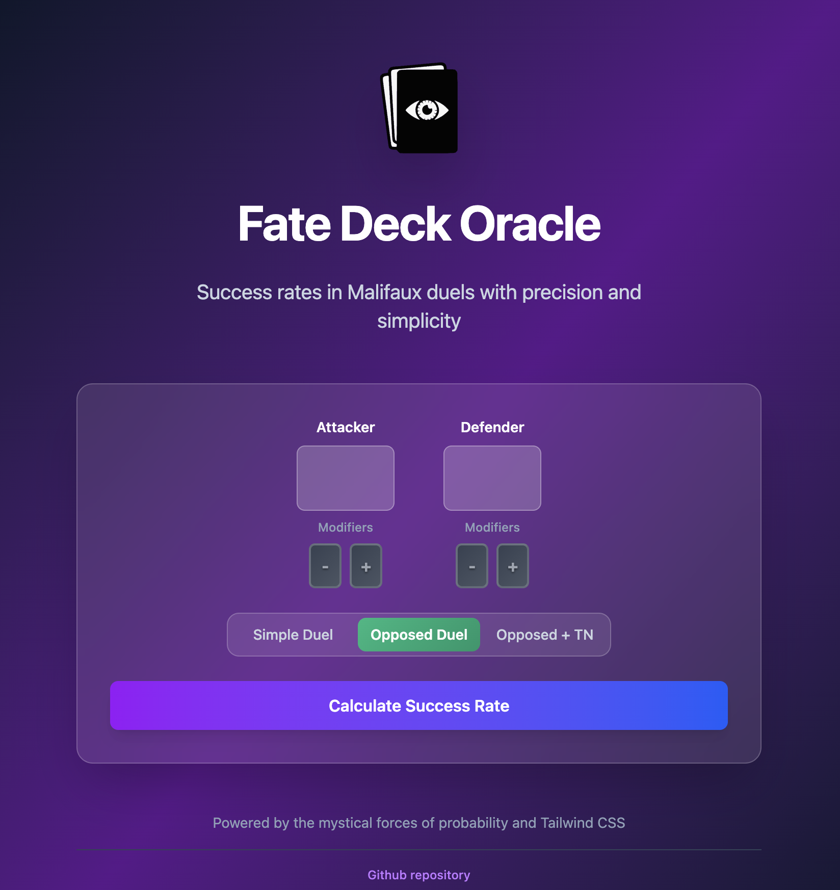

# Fate Deck Oracle

A web application for calculating success rates in Malifaux duels. Calculate your chances of success in both simple and opposed duels using the Fate deck system.

🌐 **Live Demo**: [https://fate-deck-oracle.com/](https://fate-deck-oracle.com/)



## What it does

- **Simple Duels**: Calculate success rate against a target number
- **Opposed Duels**: Calculate success rate against an opponent's stat
- **Modifier Cards**: Account for positive (+) and negative (-) flips
- **Success Rates**: See both basic success and success with raises (5+ shifts)

## Tech Stack

- **Backend**: Ruby on Rails 7.1
- **Frontend**: Tailwind CSS, Hotwire (Turbo + Stimulus)
- **Ruby Version**: 3.3.0

## Getting Started

### Prerequisites

- Ruby 3.3.0 or higher
- Rails 7.1.5 or higher

### Installation

1. Clone the repository
```bash
git clone <repository-url>
cd fate-deck-oracle
```

2. Install dependencies
```bash
bundle install
```

4. Start the development server
```bash
bin/dev
```

5. Open your browser and go to `http://localhost:3000`

## How to Use

1. **Choose Duel Type**: Select between "Simple" or "Opposed" duel
2. **Enter Stats**: Input your character's relevant stat
3. **Set Target/Defender**: For simple duels, enter target number. For opposed duels, enter opponent's stat
4. **Add Modifiers**: Use + for positive flips, - for negative flips
5. **Calculate**: Click calculate to see your success rates

## Development

### Running Tests
```bash
bundle exec rspec
```

### Code Quality
```bash
bundle exec rubocop
```

## License

This project is licensed under the MIT License - see below for details:

```
MIT License

Copyright (c) 2025 Fate Deck Oracle

Permission is hereby granted, free of charge, to any person obtaining a copy
of this software and associated documentation files (the "Software"), to deal
in the Software without restriction, including without limitation the rights
to use, copy, modify, merge, publish, distribute, sublicense, and/or sell
copies of the Software, and to permit persons to whom the Software is
furnished to do so, subject to the following conditions:

The above copyright notice and this permission notice shall be included in all
copies or substantial portions of the Software.

THE SOFTWARE IS PROVIDED "AS IS", WITHOUT WARRANTY OF ANY KIND, EXPRESS OR
IMPLIED, INCLUDING BUT NOT LIMITED TO THE WARRANTIES OF MERCHANTABILITY,
FITNESS FOR A PARTICULAR PURPOSE AND NONINFRINGEMENT. IN NO EVENT SHALL THE
AUTHORS OR COPYRIGHT HOLDERS BE LIABLE FOR ANY CLAIM, DAMAGES OR OTHER
LIABILITY, WHETHER IN AN ACTION OF CONTRACT, TORT OR OTHERWISE, ARISING FROM,
OUT OF OR IN CONNECTION WITH THE SOFTWARE OR THE USE OR OTHER DEALINGS IN THE
SOFTWARE.
```
